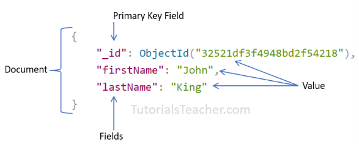
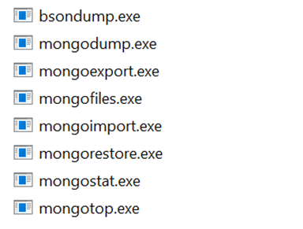

# MongoDB
MongoDB is a document-oriented open-source NoSQL database designed for ease of application development and scaling. It is one of the most popular and widely used NoSQL databases. MongoDB database is built to store a huge amount of data and also perform fast.


MongoDB (NoSQL Database) | RDBMS (SQL Server, Oracle, etc.) | .
--- | --- | ---
Database | Database
Collection | Table
Document | Row (Record)
Field	|Column



### Advantages of MongoDB
1.	MongoDB stores data as JSON based document that does not enforce the schema. It allows us to store hierarchical data in a document. This makes it easy to store and retrieve data in an efficient manner.
2.	It is easy to scale up or down as per the requirement since it is a document based database. MongoDB also allows us to split data across multiple servers.
3.	MongoDB provides rich features like indexing, aggregation, file store, etc.
4.	MongoDB performs fast with huge data.
5.	MongoDB provides drivers to store and fetch data from different applications developed in different technologies such as C#, Java, Python, Node.js, etc.
6.	MongoDB provides tools to manage MongoDB databases.

## Mongo Shell
Install mongosh and compass and Database tools from mongodb.com
```shell
mongosh <commands>

mongosh --help

db.help()

db.test.help()

show dbs

show collections

use database-name

db.dropDatabase()

db.createCollection('employees')

db.collection-name.drop()
```
#### Important Points:
- MongoDB reserves ```_id``` name for use as a unique primary key field that holds ObjectId type. However, you are free to give any name you like with any data type other than the array.
- A document field name cannot be ```null``` but the value can be.
- Most MongoDB documents cannot have duplicate field names. However, it depends on the driver you use to store a document in your application.
- A document fields can be without quotation marks ``` " " ``` if it does not contain spaces, e.g. `{ name: "Steve"}`, `{ "first name": "Steve"}` are valid fields.
- Use the dot notation to access array elements or embedded documents.
- MongoDB supports maximum document size of 16mb. Use GridFS to store more than 16 MB document.
- Fields in a BSON document are ordered. It means fields order is important while comparing two documents, e.g. `{x: 1, y: 2}` is not equal to `{y: 2, x: 1}`
- MogoDB keeps the order of the fields except `_id` field which is always the first field.
- MongoDB collection can store documents with different fields. It does not enforce any schema.
- Fields can be arrays and other embedded documents as well.


## Insert Single Document
```shell
db.employees.insertOne({ 
    _id: 1,
    lastName: "King",
})
```
Use the `find()` to list all data of a collection, and the `pretty()` method to format resulted data.
```db.employees.find().pretty()```

## Insert Multiple Documents

```shell
db.employees.insert(
    [
        { 
            _id: 1,
            lastName: "King"
        },
        { 
            _id: 2,
            lastName: "Trevor"
        },
        { 
            _id: 3,
            lastName: "Bond"  
        }
    ])
```
    
## Import Data into Collections
Visit Database tools and download the zip file for your platform, extract and copy all `.exe` files and paste them to the MongoDB bin folder. On Windows, it is `C:\Program Files\MongoDB\Server\<version>\bin` folder



open the terminal or command prompt and navigate to the location where you have the JSON file to import so that you don't need to specify the whole path. JSON or CSV

`mongoimport --db test --collection employees --file employeesdata.json –jsonArray`

`mongoimport --db test --collection employeesdata --type csv --file employees.csv --fields _id,firstName,lastName`

## Find Single Document
1. `findOne()` - returns a the first document that matched with the specified criteria.
2. `find()` - returns a cursor to the selected documents that matched with the specified criteria.

`db.employees.findOne()`
returns the first document from a collection if no parameter is passed

`db.employees.findOne({firstName: "Kapil"})`
It returns null if it cannot find a document matching the specified criteria

## Query Operators
`db.employees.findOne({salary: {$gt: 8000}})`


```
Comparison: $eq, $gt, $gte, $in, $lt, $lte, $ne, $nin
Logical: $and, $not, $nor, $or
Element: $exists, $type
Evaluation: 
Geospatial
Array:
Bitwise:
Projection Operators:
```
The rest can be found here https://docs.mongodb.com/manual/reference/operator/query/

## Find Multiple Documents
`db.employees.find()`
returns all documents from a collection if no parameter is passed

`db.employees.find(salary: {$gt: 8000})`
returns all documents from a collection matching parameter

`db.employees.find({salary: {$gt: 7000, $lt: 8000}})`

`db.employees.find({ "department.name": "Finance"})`

`db.employees.find({ "skills": "Tax"}) `
returns documents where skills contains "Tax"

`db.employees.find({ "skills":  { $in: [ "Tax", "Sales" ]}})`
returns documents where skills contains "Tax" or "Sales"

`db.employees.find({ "skills":  { $all: [ "Tax", "Accounting" ]}}) `
returns documents where skills contains "Tax" and "Accounting"

`db.employees.find({ "skills":  { $size: 3})` returns documents where skills contains 3 elements

Use the projection parameter to specify the fields to be included in the result. The projection parameter format is `{<field>: <1 or true>, <field>: <1 or true>...}` where 1 or true includes the field, and o or false excludes the field in the result.
`db.employees.find({salary: 7000}, {firstName:1, lastName:1})`


## MongoDB Cursor
The `find()` method returns a cursor object which can be used to iterate the result.
The following example gets the cursor object and assign it to a variable.

`const cursor = db.employees.find()`

```
cursor.count()
cursor.forEach()
cursor.hasNext()
cursor.isExhausted()
cursor.itcount()
cursor.limit()
cursor.map()
cursor.max()
cursor.min()
cursor.next()
cursor.pretty()
cursor.readConcern()
cursor.skip()
cursor.sort()
cursor.toArray()
```

## Update Single Document
`db.employees.updateOne({_id:1}, { $set: {firstName:'Morgan'}}) `

Use the `$inc` update operator to increase the value of the field by the specified amount.

`db.employees.updateOne({firstName:"Steve"}, { $inc: {salary: 500}}) `

You can also specify multiple fields to update. The following updates email and lastName fields.

`db.employees.updateOne({_id:2}, { $set: {lastName:"Tendulkar", email:"sachin.tendulkar@abc.com"}}) `

### Update Operators
```
$currentDate
$inc
$min
$max
$mul
$rename
$set
$setOnInsert
$unset
```

## Update Multiple Documents
The following modifies matching documents using the `updateMany()` method in `employees` collection.

`db.employees.updateMany({ salary:7000 }, { $set: { salary:8500 }}) `

The `updateMany()` method adds the specified field if it does not exist in a matching document. For example, the following will add the `location` field.
If you specify an empty filter criteria {}, then it will update all the documents. The following will update or add location field in all documents.

`db.employees.updateMany({firstName:"Steve"}, { $set: {location: "USA"}}) `

## Update Arrays in Documents
The `$set` operator overwrites the specified array instead of adding, removing, and updating array elements.

`db.employees.updateMany({_id:5},{$set:{ skills:["Sales Tax"]}})`

```
$
$[]
$[<identifier>]
$addToSet
$pop
$pull
$push
$pullAll
```

`db.employees.updateMany(
    {},
    {$push:{"skills":"Sports"}}) `
// add "Sports" to all arrays

`db.employees.updateMany(
    {_id:3},
    {$push:{"skills":"Sports"}}) `
// add "Sports" element to skills array where _id:3

`db.employees.updateMany(
    {}, 
{$push:{"skills":{$each:["Sports","Acting"]}}}) `
// adds "Sports" and "Acting" to all arrays

`db.employees.updateMany(
    {},
    { $addToSet: {"skills":"GST"} }) `
// adds "GST"to all arrays if not exist

`db.employees.updateMany(
    {},
    {$pop:{"skills":1}}) `
// removes the last element


`db.employees.updateMany(
    {},
    {$pop:{"skills":-1}}) `
//removes the first element

`db.employees.updateMany( 
    {}, 
    {$pull: { "skills": "GST" }})`
 // removes "GST" 

## Delete Documents in a Collection
- `db.collection.deleteOne()` Deletes the first matching document in a collection.
- `db.collection.deleteMany()` Deletes all the matching documents in a collection.

`db.employees.deleteOne({ salary:7000 }) `

`db.employees.deleteMany({ salary:7000 }) `

## Relations in MongoDB
In MongoDB, one-to-one, one-to-many, and many-to-many relations can be implemented in two ways:
1. Using embedded documents
2. Using the reference of documents of another collection

### Relation using Embedded Document
 
```shell
db.employee.insertOne({
     _id: ObjectId("32521df3f4948bd2f54218"),
    firstName: "John",
    lastName: "King",
    email: "john.king@abc.com",
    salary: "33000",
    DoB: new Date('Mar 24, 2011'),
    address: { 
                street:"Upper Street",
                house:"No 1",
                city:"New York",
                country:"USA"
            }
})
```
### Implement One-to-One Relation using Reference
```
db.address.insertOne({
     _id: 101,
    street:"Upper Street",
    house:"No 1",
    city:"New York",
    country:"USA"
})

db.employee.insertOne({
    firstName: "John",
    lastName: "King",
    email: "john.king@abc.com",
    salary: "33000",
    DoB: new Date('Mar 24, 2011'),
    address: 101
})
```

### Find Related Documents
```shell
const addrId = db.employee.findOne({firstName:'John'}).address

db.address.findOne({_id:addrId})
```

Use the aggregation pipeline stage `$lookup` to find the related data from the collection, as shown below.

```shell
db.employee.aggregate([{$lookup:{from:'address',localField:'address',foreignField:"_id",as:'addr'}}])
```

## Aggregation in MongoDB
Aggregation is the process of selecting data from a collection in MongoDB. It processes multiple documents and returns computed results.
Use aggregation to group values from multiple documents, or perform operations on the grouped data to return a single result.

Aggregation operations can be performed in two ways:
1. Using Aggregation Pipeline.
2. Using single purpose aggregation methods: `db.collection.estimatedDocumentCount(), db.collection.count() and db.collection.distinct()`.

`db.collection.aggregate([ {stage1}, {stage2}, {stage3}...])`

**Stages:**

**Collection** -> `$match` -> `$group` -> `$sort` -> `$project` -> **Output**

The $match stage is usually the first stage to select only the matching documents from a collection. It is equivalent to the `find()` method
```shell
db.employees.aggregate([ {$match:{ gender: 'female'}} ])
```

Use the `$group` stage to group the input documents by the specified `_id` expression and returns a single document containing the accumulated values for each distinct group. Consider the following example.

```shell
db.employees.aggregate([ 
    { $match:{ gender:'male'}}, 
    { $group:{ _id:{ deptName:'$department.name'}, totalSalaries: { $sum:'$salary'} } 
}])
```
The `$sort` stage is used to sort the documents based on the specified field in ascending or descending order. The following sorts all male employees.
```shell
db.employees.aggregate([
    { $match:{ gender:'male'}}, 
    { $group:{ _id:{ deptName:'$department.name'}, totalEmployees: { $sum:1} } },
    { $sort:{ deptName:1}}
])
```

